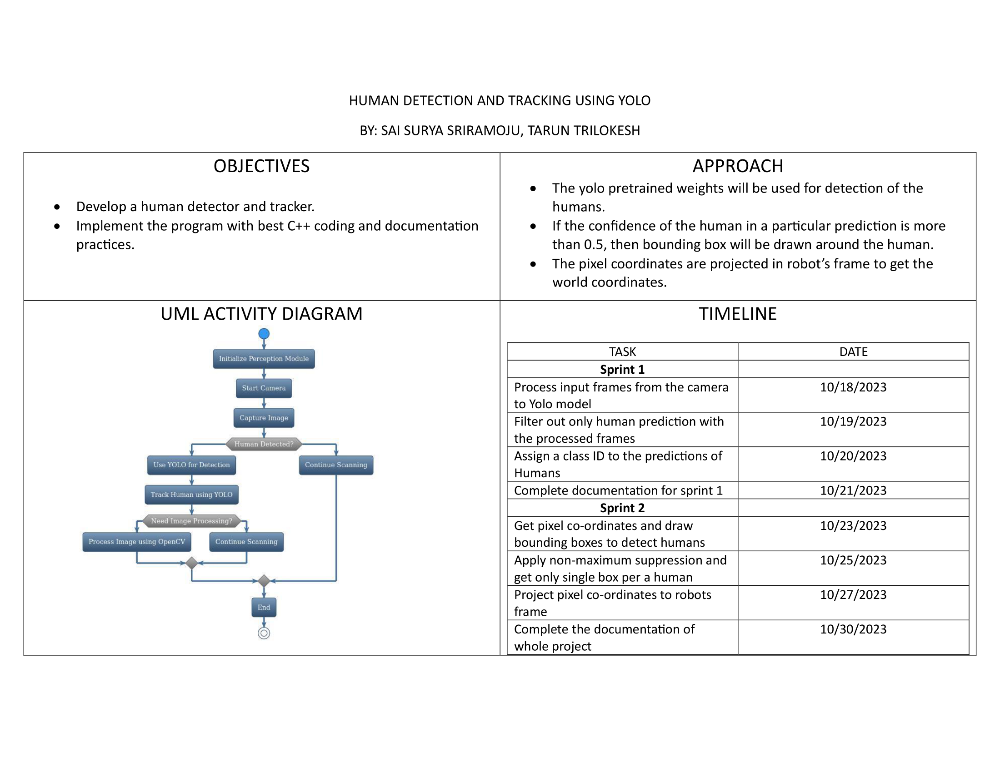

# Acme Robotics: Human Obstacle Detection and Tracking System


[](https://codecov.io/gh/tarunreddyy/AcmeRobotics-PerceptionModule)
[](https://opensource.org/licenses/MIT)

Acme Robotics introduces an innovative solution aimed at revolutionizing robot-human interactions in shared environments. The core of this solution is the Perception Module, which focuses on detecting and tracking human obstacles using the YOLO (You Only Look Once) framework and a monocular camera.

## Team Details

| Team 11 |
|---|
| Sprint 1 |
| **Tarun Trilokesh - 118450766** (Driver) |
| **Sai Surya Sriramoju - 119224113** (Navigator) |
| Sprint 2 |
| **Tarun Trilokesh - 118450766** (Navigator) |
| **Sai Surya Sriramoju - 119224113** (Driver) |

## Work/Time Log

[Work/Time Log Google Sheet](https://docs.google.com/spreadsheets/d/1ZnuffDtKv5V0M3b9U_pYbGnPewuxgqhy6Ek-bALHVhM/edit?usp=sharing)

## Product Backlog

[Product Backlog Google Sheet](https://docs.google.com/spreadsheets/d/1ErQ7gKkVmTWev2d3xuYLis9wqiOIVZpCDItgP2cPW3Q/edit?usp=sharing)

## Iteration Backlog

[Iteration Backlog Google Sheet](https://docs.google.com/spreadsheets/d/1pN1JAZEiftC3jD7QPq5EIy_5mWXuyCwmZllS3axIA70/edit?usp=sharing)

## Installation and Execution

Follow the steps below to set up and run the Human Obstacle Detection and Tracking system:

```bash
# Clone the repository:
  git clone https://github.com/tarunreddyy/AcmeRobotics-PerceptionModule.git
  cd AcmeRobotics-PerceptionModule

# Build the project:
  cmake -S ./ -B build/
  cmake --build build/

# Execute the program:
  ./build/PerceptionModule

# Run tests:
  ./build/runTests

# Build docs for Doxygen format:
  cmake --build build/ --target docs
  # open a web browser to browse the doc
  open docs/html/index.html
```

## Building for code coverage
```bash
# if you don't have gcovr or lcov installed, do:
  sudo apt-get install gcovr lcov
# Set the build type to Debug and WANT_COVERAGE=ON
  cmake -D WANT_COVERAGE=ON -D CMAKE_BUILD_TYPE=Debug -S ./ -B build/
# Now, do a clean compile, run unit test, and generate the covereage report
  cmake --build build/ --clean-first --target all test_coverage
# open a web browser to browse the test coverage report
  open build/test_coverage/index.html

This generates a index.html page in the build/test_coverage sub-directory that can be viewed locally in a web browser.
```

## UML Diagram

The UML diagram provides a detailed view of the class structures, dependencies, and interactions within the Perception Module.


## Activity Diagram

The activity diagram showcases the workflow of the Perception Module, detailing the steps involved in human detection and tracking.


## Quad Chard

Quad chart visualizing our robot's human detection and tracking project, showcasing key components and progress.


## The video explanation of the phase zero of this project can be found [here](https://drive.google.com/file/d/1l0VtLcwZwrXFP7Ti_4hcNFPFEvkQYVFW/view?usp=sharing)

## Technologies and Tools

- **Programming Language**: C++14
- **Build System**: CMake
- **Unit Testing**: Google Test framework
- **Static Analysis**: cppcheck
- **Coding Standard**: Google C++ Styleguide with cpplint validation
- **Documentation**: Doxygen

## External Libraries

- **YOLO (You Only Look Once)**: Used for real-time human detection and tracking.
- **OpenCV**: Employed for supplementary image processing tasks.

All libraries integrated are open-source, ensuring smooth integration and eliminating potential legal complications.

## Key Features

- Robust Human Obstacle Detection and Tracking using the YOLO framework.
- Comprehensive documentation and unit tests.
- UML and activity diagrams detailing system design and workflow.
- GitHub repository with continuous integration setup.
- Demonstrations showcasing the module's real-world application.

## Collaboration Strategy

Our development process emphasizes pair programming to ensure high-quality code and foster team collaboration. Regular sprint reviews and retrospectives align our efforts with Acme Robotics' vision and project milestones.
